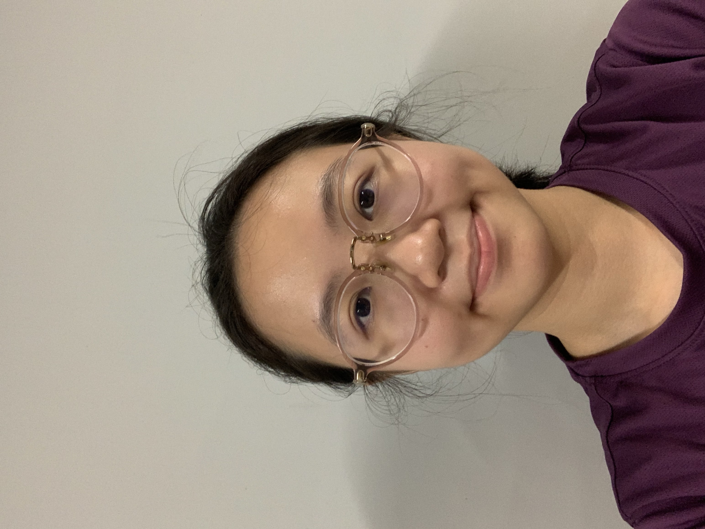
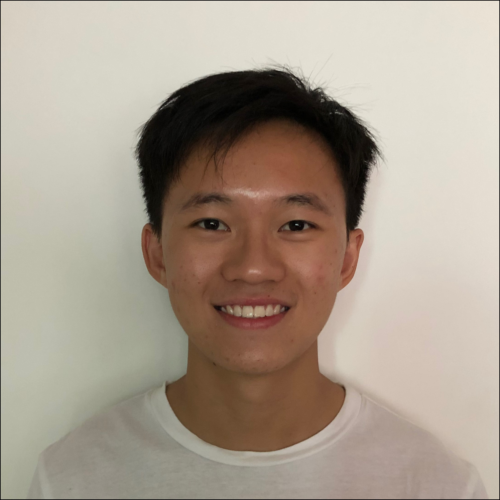

# About Us

We are a team based in the [School of Computing, National University of Singapore](http://www.comp.nus.edu.sg).

Unfortunately, we currently do not offer any means to contacting us, however, you can contact us through our [GitHub repository](https://github.com/AY2324S2-CS2113T-T09-3/tp).

## StockPal's team (CS2113T-T09-3)

### Ng Yao Dong

[[GitHub](https://github.com/NgYaoDong)]
[[Portfolio](team/ngyaodong.md)]

* Role: Developer

### Leong Xing Yu

[[GitHub](http://github.com/leongxingyu)]
[[Portfolio](team/leongxingyu.md)]

* Role: Developer

### Edmund Tang

[[GitHub](http://github.com/edmundtangg)] 
[[Portfolio](team/edmundtangg.md)]

* Role: Developer

### Ko Jia Ling

[[GitHub](http://github.com/Kobot7)]
[[Portfolio](team/kobot7.md)]

* Role: Developer

### Wong Jun Jie

[[GitHub](http://github.com/wjunjie01)]
[[Portfolio](team/wjunjie01.md)]

* Role: Developer

### Luan Chee Seong

[[GitHub](http://github.com/cheeseong2001)]
[[Portfolio](team/cheeseong2001.md)]

* Role: Developer
