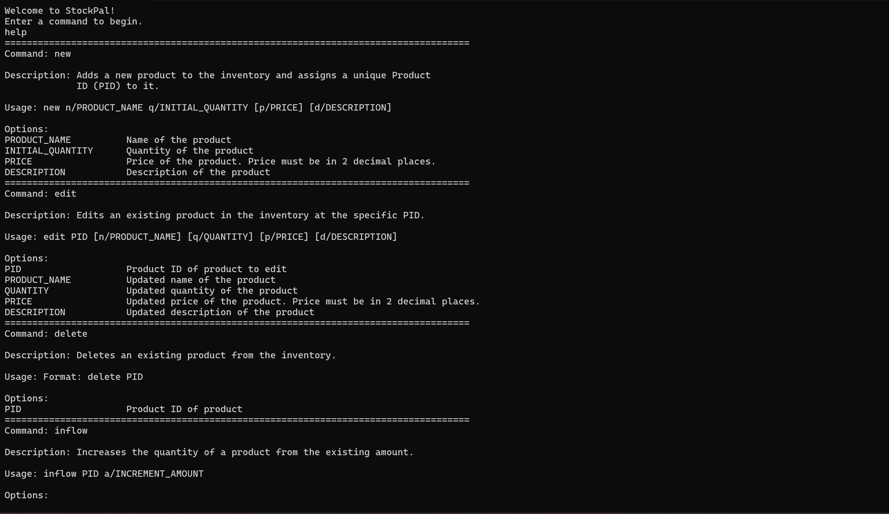

**StockPal is a CLI application designed for small business owners.** 
Provides a user-friendly and cost-effective solution for small business owners to manage their inventory, eliminating the hassle of manual tracking of items.

* If you are interested in using StockPal, head over to the [_Quick Start_ section of the **User Guide**](UserGuide.md#quick-start).
* If you are interested about developing StockPal, the [**Developer Guide**](DeveloperGuide.md) is a good place to start.

Useful links:
* [User Guide](UserGuide.md)
* [Developer Guide](DeveloperGuide.md)
* [About the team](AboutUs.md)

Project Repository: 

**Acknowledgements**

* Libraries used: [OpenCSV](https://opencsv.sourceforge.net/), [JSON-Java](https://github.com/stleary/JSON-java)