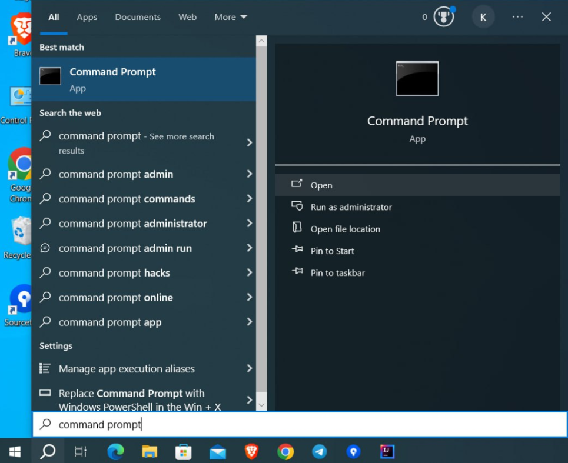
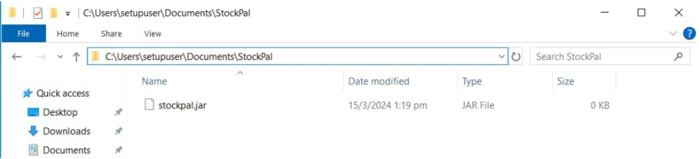
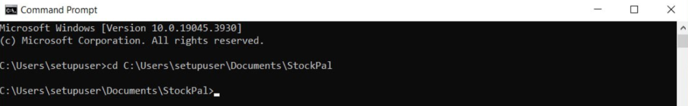

# StockPal's User Guide

# Introduction
StockPal is a command line interface (CLI) application designed to help small E-commerce business owners who are 
just starting up to manage their stock-taking effectively. Users would mostly interact with StockPal via text commands.

StockPal is compatible for usage on Windows, Mac and Linux systems.

Not sure where to begin? Start by learning [how to utilize this user guide](#using-this-guide).

# Table of Contents
- [Introduction](#introduction)
- [Using This Guide](#using-this-guide)
- [Quick Start](#quick-start)
    - [Downloading StockPal](#downloading-stockpal)
    - [Running StockPal](#running-stockpal)
- [Glossary](#glossary)
- [Features](#features)
    - [Notes about the Command Format](#commandFormat)
    - [Viewing help: `help`](#viewing-help-help)
    - [Adding a new product: `new`](#adding-a-new-product-new)
    - [Listing all products: `list`](#listing-all-products-list)
    - [Editing product details: `edit`](#editing-product-details-edit)
    - [Increasing quantity of existing product: `inflow`](#increasing-a-product-quantity-inflow)
    - [Decreasing quantity of existing product: `outflow`](#decreasing-a-product-quantity-outflow)
    - [Viewing past inflow/outflow of existing product: `history`](#viewing-past-inflow--outflow-of-existing-product-history)
    - [Deleting a product and its details: `delete`](#deleting-a-product-and-its-details-delete)
    - [Find a keyword in the Product list: `find`](#find-a-keyword-in-the-product-list-find)
    - [Exiting the program: `exit`](#exiting-the-program-exit)
    - [Saving the data](#saving-the-data)
    - [Editing the data file](#editing-the-data-file)
- [Command Summary](#command-summary)
- [FAQ](#faq)

<div style="page-break-after: always;"></div>

<!--- @@author NgYaoDong --->
# Using This Guide
Below are the symbols used in this guide and the meaning of these symbols.

| **Symbol**           | **Meaning**                                                                                               |
|----------------------|-----------------------------------------------------------------------------------------------------------|
| :exclamation:        | The exclamation mark symbol indicates actions that you should be _cautious_ about.                        |
| :information_source: | The **i** symbol indicates notes that are important for you when using the application.                   |
| :bulb:               | The lightbulb symbol indicates tips that hold useful information or advice that might be helpful for you. |

<div style="page-break-after: always;"></div>

<!--- @@author Kobot7 --->
# Quick Start

## Downloading StockPal

1.  Ensure you have [Java 11](https://www.oracle.com/java/technologies/javase-jdk11-downloads.html) or above installed in your computer.

2.  Download the latest `StockPal.jar` from [here](https://github.com/AY2324S2-CS2113T-T09-3/tp/releases).

3.  Copy the file to the folder you want to use as the home folder for
    the application. For example,`C:\Users\setupuser\Documents\StockPal\StockPal.jar`.

## Running StockPal

1.  **For Windows users:**

    Open a command prompt terminal. You can do so by searching for `command
    prompt` in the Windows search bar.<br>

    
    <br><br>
    <!--- @@author leongxingyu --->
    
    **For MAC users:**

    Open a terminal. You can do so by searching for the `terminal` using the Spotlight icon in the menu bar. Click on the terminal.<br>

    
    <br><br>
    <!--- @@author Kobot7 --->
2.  Determine the file path to the home folder of `StockPal.jar`. You can
    do so by navigating to `StockPal.jar` in File Explorer (Windows) or Finder (MAC). For example,
    the image below shows that the file path to the home folder of
    `StockPal.jar` is `C:\Users\setupuser\Documents\StockPal`.<br>

    
    <br><br>

3.  In the command prompt terminal, navigate to the home folder using
    the command `cd <file path to the home folder>`. For example, `cd
    C:\Users\setupuser\Documents\StockPal`.<br>

    
    <br><br>

4.  In the command prompt terminal, run StockPal using the command `java -jar ./StockPal.jar`.

<div style="page-break-after: always;"></div>
    
# Glossary
The following is a collection of frequently used terms in the User Guide and their meanings.

PID (Product ID) - a unique number assigned to each product for identification purposes.

CLI (Command Line Interface) - a text-based interface used to interact with our program by entering commands into a terminal.

CSV (Comma-Separated Values) - a file format used to store tabular data. Each line represents a row of data, and each field within a row is usually separated by a comma.

JSON (JavaScript Object Notation) - a file format for storing and transporting data.

<div style="page-break-after: always;"></div>

<!--- @@author NgYaoDong --->
# Features
<div id="commandFormat" style="padding: 15px; border: 1px solid transparent; margin-bottom: 20px; border-radius: 4px; color: #31708f; background-color: #d9edf7;">
:information_source: <strong>Notes about the command format:</strong><br>
<ul>
    <li>Words in <code>UPPER_CASE</code> are the parameters to be supplied by the user.<br>
        e.g. in <code>new n/PRODUCT_NAME q/INITIAL_QUANTITY</code>, <code>PRODUCT_NAME</code> and <code>INITIAL_QUANTITY</code> are parameters which can be used as <code>new n/Math Textbook q/100</code>.</li>
    <li>Items in square brackets are optional.<br>
        e.g. <code>n/PRODUCT_NAME q/INITIAL_QUANTITY [p/PRICE]</code> can be used as <code>n/Math Textbook q/100 p/20.00</code> or as <code>n/Math Textbook q/100</code>.</li>
    <li>Parameters must be in the specified order.<br>
        e.g. if the command specifies <code>n/PRODUCT_NAME q/INITIAL_QUANTITY</code>, <code>q/INITIAL_QUANTITY n/PRODUCT_NAME</code> is <strong>not</strong> acceptable.</li>
    <li>Commands and flags are not case-sensitive.<br>
        e.g. Both commands <code>LIST -SN</code> and <code>List -sn</code> will present the same output.
</ul>
</div>

<!--- @@author Kobot7 --->
## Viewing Help: `help`

Provides command details for all or specific commands.

### When to Use?
This is a useful command to start with if you are new to StockPal!

Format: `help [COMMAND]`

| Parameter | Representation                                          | Constraints                                                                                                                                                                                                                                                                                                                                                         |
|-----------|---------------------------------------------------------|---------------------------------------------------------------------------------------------------------------------------------------------------------------------------------------------------------------------------------------------------------------------------------------------------------------------------------------------------------------------|
| `COMMAND` | The command for which you wish to display the help page | - Must be a valid command keyword<br/>- List of valid command keywords: <code>help</code>, <code>new</code>, <code>list</code>, <code>edit</code>, <code>delete</code>, <code>inflow</code>, <code>outflow</code>, <code>history</code>, <code>find</code>, <code>exit</code>.<br/>- If `COMMAND` is left empty, command details for all commands will be displayed |

<div style="padding: 15px; border: 1px solid transparent; margin-bottom: 20px; border-radius: 4px; color: #31708f; background-color: #d9edf7;">
:information_source: <strong>Note:</strong><br>
<code>COMMAND</code> is case-insensitive.<br>
e.g. <code>help</code> will be considered the same as <code>HELP</code> and <code>hELP</code>.
</div>

### Example 1
Input:

```
help inflow 
```

Output:
```
====================================================================================
Command: inflow

Description: Increases the quantity of a product from the existing amount.

Usage: inflow PID a/INCREMENT_AMOUNT

Options:
PID                   Product ID of product
INCREMENT_AMOUNT      Quantity of product to add
====================================================================================
```

<div style="page-break-after: always;"></div>

<!--- @@author EdmundTangg --->
## Adding a New Product: `new`

Creates a new product to the inventory and assigns a unique Product ID (PID) to it.

### When to Use?

* When starting as a new user of StockPal, use this command repeatedly to fill up your inventory to start tracking!
* Subsequently, when your business introduces new products, use this command to add them in too!


Format:
```
new n/PRODUCT_NAME q/INITIAL_QUANTITY [p/PRICE] [d/DESCRIPTION]
```

| Parameter          | Representation                              | Constraints                                                                                                                                                                                        |
|--------------------|---------------------------------------------|----------------------------------------------------------------------------------------------------------------------------------------------------------------------------------------------------|
| `PRODUCT_NAME`     | Name of new product to be added.            | - Limited to 50 characters.<br/>- Allowed characters:<br/>`a-z`, `A-Z`, `0-9`, ` `, `()`, `[]`, `,`, `.`, `-`, `_`<br/>- Name must be unique, i.e. no existing product with the same product name. |
| `INITIAL_QUANTITY` | Quantity of the new product to be added.    | Must be an integer more than or equal to 0.                                                                                                                                                        |
| `PRICE`            | Price of the new product to be added.       | - Must be a numeric value more than equal to 0.<br/>- Can have at most 2 decimal places.                                                                                                           |
| `DESCRIPTION`      | Description of the new product to be added. | - Limited to 100 characters<br/>- Allowed characters:<br/>`a-z`, `A-Z`, `0-9`, ` `, `()`, `[]`, `,`, `.`, `-`, `_`                                                                                 |

<div style="padding: 15px; border: 1px solid transparent; margin-bottom: 20px; border-radius: 4px; color: #31708f; background-color: #d9edf7;">
:information_source: <strong>Note:</strong><br>
<ol>
    <li><code>PRODUCT_NAME</code> is case-insensitive, which means a name in lowercase will be considered as having the same name as the name in uppercase.<br>e.g. <code>Pen</code> will be considered the same as <code>pen</code> and <code>PEN</code>.</li>
    <li>When entering <code>0</code>, <code>0.0</code> or <code>0.00</code> for <code>PRICE</code>, StockPal will deem it as not having <code>PRICE</code> entered, and display <code>[X]</code> for <code>PRICE</code> when using <code>list</code> command.</li>
</ol>
</div>

### Example 1
Input:

```
new n/Pen q/40 
```

Output:

```
Product has been added.
```

Explanation:

This command adds your product to the inventory. The product’s details are as follows:
- Name of the product is `Pen`.
- Quantity of `Pen` is `40` units.


### Example 2
Input:

```
new n/Ruler q/30 p/2.00 d/Curve Ruler
```

Output:

```
Product has been added.
```

Explanation:

This command adds your product to the inventory. The product’s details are as follows:
- Name of the product is `Ruler`.
- Quantity of `Ruler` is `30` units.
- Price of each unit is `$2.00`.
- Description of the `Ruler` product is `Curve Ruler`, which is the type of ruler.

<div style="page-break-after: always;"></div>

<!--- @@author wjunjie01 --->
## Listing All Products: `list`
Lists all products in inventory.

Format: `list [-sn|-sq]`

Sorting:
- By default, products are sorted according to their PID.
- To sort according to their names, use the `-sn` field.
- To sort according to their quantity, use the `-sq` field.

<div style="padding: 15px; border: 1px solid transparent; margin-bottom: 20px; border-radius: 4px; color: #8a6d3b; background-color: #fcf8e3;">
:bulb: <strong>Tip:</strong> Some of the commands may require PID as a compulsory field. Use <code>list</code> to obtain
the required PID of the particular product you want to access.
</div>

### Example 1

Context:
- View a list sorted by product PID.

Input: `list`

Output:
```
====================================================================================
1. PID: 1  |  Name: Pen  |  Quantity: 40  |  Price: [X]
Description: [X]
====================================================================================
2. PID: 2  |  Name: Ruler  |  Quantity: 30  |  Price: $2.00
Description: Curve Ruler
====================================================================================
```

### Example 2

Context:
- Sort a list according to the quantity of the products.

Input: `list -sq`

Output:
```
====================================================================================
1. PID: 2  |  Name: Ruler  |  Quantity: 30  |  Price: $2.00
Description: Curve Ruler
====================================================================================
2. PID: 1  |  Name: Pen |  Quantity: 40  |  Price: [X]
Description: [X]
====================================================================================
```

<div style="page-break-after: always;"></div>

<!--- @@author Kobot7 --->
## Editing Product Details: `edit`

Edits an existing product in the inventory at the specific PID by the input value(s).

Format: 
```
edit PID [n/PRODUCT_NAME] [q/QUANTITY] [p/PRICE] [d/DESCRIPTION]
```
<div style="padding: 15px; border: 1px solid transparent; margin-bottom: 20px; border-radius: 4px; color: #31708f; background-color: #d9edf7;">
:information_source: <strong>Note:</strong> At least one parameter must be provided.
</div>

| Parameter      | Representation                                | Constraints                                                                                                                                                                                       |
|----------------|-----------------------------------------------|---------------------------------------------------------------------------------------------------------------------------------------------------------------------------------------------------|
| `PID`          | Product ID of the existing product.           | Must be a valid Product ID of an existing product.                                                                                                                                                |
| `PRODUCT_NAME` | New product name of the product to be edited. | - Limited to 50 characters<br/>- Allowed characters:<br/>`a-z`, `A-Z`, `0-9`, ` `, `()`, `[]`, `,`, `.`, `-`, `_`<br/>- Name must be unique, i.e. no existing product with the same product name. |
| `QUANTITY`     | New quantity of the product to be edited.     | Must be an integer more than or equal to 0                                                                                                                                                        |
| `PRICE`        | New price of the product to be edited.        | - Must be a numeric value more than equal to 0<br/>- Can have at most 2 decimal places                                                                                                            |
| `DESCRIPTION`  | New description of the product to be edited.  | - Limited to 100 characters<br/>- Allowed characters:<br/>`a-z`, `A-Z`, `0-9`, ` `, `()`, `[]`, `,`, `.`, `-`, `_`                                                                                |

<div style="padding: 15px; border: 1px solid transparent; margin-bottom: 20px; border-radius: 4px; color: #31708f; background-color: #d9edf7;">
:information_source: <strong>Note:</strong><br>
<ol>
    <li><code>PRODUCT_NAME</code> is case-insensitive, which means a name in lowercase will be considered as having the same name as the name in uppercase.<br>e.g. <code>Pen</code> will be considered the same as <code>pen</code> and <code>PEN</code>.</li>
    <li>When entering <code>0</code>, <code>0.0</code> or <code>0.00</code> for <code>PRICE</code>, StockPal will deem it as not having <code>PRICE</code> entered, and display <code>[X]</code> for <code>PRICE</code> when using <code>list</code> command.</li>
</ol>
</div>

<div style="padding: 15px; border: 1px solid transparent; margin-bottom: 20px; border-radius: 4px; color: #8a6d3b; background-color: #fcf8e3;">
:bulb: <strong>Tip:</strong> If you are looking to increase or decrease the amount of stock of a particular product,
use <code><a href="https://ay2324s2-cs2113t-t09-3.github.io/tp/UserGuide.html#increasing-a-product-quantity-inflow">inflow</a></code>
or <code><a href="https://ay2324s2-cs2113t-t09-3.github.io/tp/UserGuide.html#decreasing-a-product-quantity-outflow">outflow</a></code> instead.

It is strongly <strong>not recommended</strong> to use <code>edit</code> for incoming or outgoing stocks. Unlike <code>inflow</code> and <code>outflow</code>, the change
in product quantity using the <code>edit</code> feature <i>will not be tracked</i> and hence will not appear under
<code><a href="https://ay2324s2-cs2113t-t09-3.github.io/tp/UserGuide.html#viewing-past-inflow--outflow-of-existing-product-history">history</a></code>.
</div>

### Example 1
Context:
- Product `Pen`’s Product ID (PID) is 1.
- You wish to update `Pen`'s information as follows.
  - PRICE: $1.50
  - DESCRIPTION: Sarasa Blue Pen

Input:

```
edit 1 p/1.50 d/Sarasa Blue Pen
```

Output: 

```
Product details have been updated.
```

### Example 2
Context
- `Ruler`’s Product ID (PID) is 2.
- You wish to update `Ruler`’s information as follows.
  - PRODUCT_NAME: Curve Ruler
  - QUANTITY: 35
  - PRICE: $2.50
  - DESCRIPTION: Math Curve Ruler

Input:

```
edit 2 n/Curve Ruler q/35 p/2.50 d/Math Curve Ruler
```

Output:

```
Product details have been updated.
```

<div style="page-break-after: always;"></div>

<!--- @@author leongxingyu --->
## Increasing a Product Quantity: `inflow`

Increase the quantity of an existing product in the inventory at the specific PID by a specified amount.

Format: 
```
inflow PID a/QUANTITY
```

| Parameter  | Representation                       | Constraints                                                                              |
|------------|--------------------------------------|------------------------------------------------------------------------------------------|
| `PID`      | Product ID of the existing product.  | Must be a valid Product ID of an existing product.                                       |
| `QUANTITY` | Quantity of the product to be added. | Must be an integer more than or equal to 0 and smaller or equal to INT_MAX (2147483647). |

<div style="padding: 15px; border: 1px solid transparent; margin-bottom: 20px; border-radius: 4px; color: #8a6d3b; background-color: #fcf8e3;">
:bulb: <strong>Tip:</strong> Use this command instead of <a href="https://ay2324s2-cs2113t-t09-3.github.io/tp/UserGuide.html#editing-product-details-edit"><code>edit</code></a> 
if you already have an existing product and just want to <i>increase</i> the quantity when you have new stocks. 
</div>

### Example 1
Context: 
- Product `Pen`'s Product ID (PID) is 1.
- Current `QUANTITY` of `Pen` is 40.
- Now, you have 20 new incoming stocks for `Pen` and you wish to update the quantity.

Input:
```
inflow 1 a/20
```

Output:
```
Quantity updated. Quantity: 60
```

### Example 2
Context:
- Product `Curve Ruler`'s Product ID (PID) is 2.
- Current `QUANTITY` of `Curve Ruler` is 35.
- Now, you have 10 new incoming stocks for `Curve Ruler` and you wish to update the quantity.

  Input:
```
inflow 2 a/10
```

Output:
```
Quantity updated. Quantity: 45
```

Explanation:
The `inflow` command will update the quantity of the product by performing addition
of the current quantity and the inflow quantity.

## Decreasing a Product Quantity: `outflow`

Decrease the quantity of an existing product in the inventory at the specific PID.

Format:
```
outflow PID a/QUANTITY
```

| Parameter  | Representation                         | Constraints                                                                               |
|------------|----------------------------------------|-------------------------------------------------------------------------------------------|
| `PID`      | Product ID of the existing product.    | Must be a valid Product ID of an existing product.                                        |
| `QUANTITY` | Quantity of the product to be removed. | Must be an integer more than or equals to 0 and smaller or equal to INT_MAX (2147483647). |

<div style="padding: 15px; border: 1px solid transparent; margin-bottom: 20px; border-radius: 4px; color: #8a6d3b; background-color: #fcf8e3;">
:bulb: <strong>Tip:</strong> Use this command instead of <a href="https://ay2324s2-cs2113t-t09-3.github.io/tp/UserGuide.html#editing-product-details-edit"><code>edit</code></a> 
if you already have an existing product and just want to <i>decrease</i> the quantity when you sell your stocks. 
</div>

### Example 1
Context:
- Product `Curve Ruler`'s Product ID (PID) is 2.
- Current `QUANTITY` of `Curve Ruler` is 45.
- Now, you sold 30 `Curve Ruler` and you wish to update the quantity.

Input:
```
outflow 2 a/30
```

Output:
```
Warning! This product is low in quality.
Quantity updated. Quantity: 15
```

<div style="padding: 15px; border: 1px solid transparent; margin-bottom: 20px; border-radius: 4px; color: #8a6d3b; background-color: #fcf8e3;">
:bulb: <strong>Tip:</strong> Note that the warning will only appear once when the quantity first falls
below quantity of 20. All low quantity products will be displayed when you exit the program.
</div>

<div style="padding: 15px; border: 1px solid transparent; margin-bottom: 20px; border-radius: 4px; color: #8a6d3b; background-color: #fcf8e3;">
:bulb: <strong>Tip:</strong> Do note that if you added a new product with a quantity lower than the threshold
quantity, warning will also be raised. 
</div>

### Example 2
Context:
- Product `Pen`'s Product ID (PID) is 1.
- Current `QUANTITY` of `Pen` is 60.
- Now, you sold 35 `Pen` and you wish to update the quantity.

Input:
```
outflow 1 a/35
```

Output:
```
Quantity updated. Quantity: 25
```

<div style="padding: 15px; border: 1px solid transparent; margin-bottom: 20px; border-radius: 4px; color: #8a6d3b; background-color: #fcf8e3;">
:bulb: <strong>Tip:</strong> Since the new quantity does not fall below 20, no warning is given. 
</div>

Explanation:
The `outflow` command will update the quantity of the product by performing subtraction
of the outflow quantity from the current quantity.

<div style="page-break-after: always;"></div>

<!--- @@author EdmundTangg --->
## Viewing Past Inflow / Outflow of Existing Product: `history`

### When to Use?
When you want to check on the previous inflow or outflow of a product, use this command!


Format:
```
history PID
```

| Parameter  | Representation                      | Constraints                                        |
|------------|-------------------------------------|----------------------------------------------------|
| `PID`      | Product ID of the existing product. | Must be a valid Product ID of an existing product. |


### Example 1
Input:
```
history 1
```

Output:
```
1. PID: 1  |  Change in quantity: 20  |  Date of inflow: 29-03-2024 17:27:24
2. PID: 1  |  Change in quantity: -35  |  Date of outflow: 05-04-2024 17:33:40
```

**Explanation:** <br>
This command will find any inflow or outflow quantities of your product which has PID 1, which is your `Pen` product. <br>
As seen, you tried to: 
* Increase the quantity of `Pen` by 20 on 29th March 2024, at 17:27:24 hours
* Decrease the quantity of `Pen` by 35 on 5th April 2024, at 17:33:40 hours

### Example 2
Input:
```
history 2
```

Output:
```
1. PID: 2  |  Change in quantity: 10  |  Date of inflow: 18-03-2024 08:00:31
2. PID: 2  |  Change in quantity: -30  |  Date of outflow: 01-04-2024 10:00:00
```

**Explanation:** <br>
This command will find any inflow or outflow quantities of your `Curve Ruler` which has PID 2. <br>
As seen, you tried to:
* Increase the quantity of `Curve Ruler` by 10 on 18th March 2024, at 08:00:31 hours 
* Decrease the quantity of `Curve Ruler` by 30 on 1st April 2024, at 10:00:00 hours

<div style="page-break-after: always;"></div>

<!--- @@author cheeseong2001 --->
## Deleting a Product and its Details: `delete`

Deletes an existing product from the inventory.

Format: `delete PID`

| Parameter | Representation                      | Constraints                                        |
|-----------|-------------------------------------|----------------------------------------------------|
| `PID`     | Product ID of the existing product. | Must be a valid Product ID of an existing product. |


### Example 1
Input:
```
delete 1
```

Output:
```
Product has been deleted.
```

### Example 2
Suppose the product with PID 3 is not in the inventory. As such you should not be able to delete anything.

Input:
`delete 3`

Output:
`Product with the following PID is not found: 3`

<div style="page-break-after: always;"></div>

<!--- @@author EdmundTangg --->
## Find a Keyword in the Product List: `find`
### When to use?
This is a useful command for when you want to know if there is already an existing product that matches your keyword. 
Or when you just want to get the product’s PID in a long list of products.


Format: `find KEYWORD`
<div style="padding: 15px; border: 1px solid transparent; margin-bottom: 20px; border-radius: 4px; color: #31708f; background-color: #d9edf7;">
:information_source: <strong>Note:</strong><br>
<ul>
    <li>Only the product name is searched.</li>
    <li>The search is case-insensitive. e.g “find apple” will match “Apple”.</li>
    <li>Partial or full words will be matched e.g. “find Pe” will match “Pen”.</li>
</ul>
</div>

### Example 1
Input:
```
find Ruler
```

Output:
```
====================================================================================
1. PID: 2  |  Name: Curve Ruler  |  Quantity: 15  |  Price: $2.50
Description: Math Curve Ruler
====================================================================================
```

**Explanation:** <br>
This command will find any product name that contains `Ruler` in the product’s name,
regardless of case sensitivity.

### Example 2
Input:
```
find THISISASUPERLONGSTRINGANDTHEREISNOMATCH
```

Output:
```
No matches found.
```

**Explanation:** <br>
This command will find any product name that contains `THISISASUPERLONGSTRINGANDTHEREISNOMATCH` in the product’s name, regardless of case sensitivity.
There is however no match in any of the product’s names in the product list.

<div style="page-break-after: always;"></div>

<!--- @@author cheeseong2001 --->
## Exiting the program: `exit`
Exits the program.

Format:
```
exit
```

### Example 1

Input:
```
exit
```

Output:
```
These products have low quantity! Please top up!
====================================================================================
PID: 2  |  Name: Curve Ruler  |  Quantity: 15 
====================================================================================
Exiting program, goodbye!
```

Explanation:
This command will exit the program and print out all the products that are low in quantity. Our program will print a statement to bid you goodbye!

### Example 2

Input:
```
exit wrong usage
```
Output:
```
Exit Command does not take in any extra arguments!
```
Explanation:
In example 2, the literal string input:`exit wrong usage` was entered by the user.

To address possible typo issues caused by typing "exit" when you want to type "edit", ensure that no arguments should be
passed to the Exit command.

<div style="page-break-after: always;"></div>

<!--- @@author NgYaoDong --->
## Saving the Data

StockPal data is saved in the hard disk automatically after any command that changes the data. There is no need to save manually.


## Editing the Data File

StockPal inventory data is saved automatically as a CSV file `[JAR file location]/data/inventory.csv`, while the past transactions data is saved automatically as a JSON file `[JAR file location]/data/transactions.json`. Advanced users are welcome to update data directly by editing these data files, even though it is **highly not recommended**.

<div style="padding: 15px; border: 1px solid transparent; margin-bottom: 20px; border-radius: 4px; color: #31708f; background-color: #d9edf7;">
:information_source: <strong>Note:</strong> Allowed characters to use when editing the data file:<br>
<code>a-z</code>, <code>A-Z</code>, <code>0-9</code>, <code> </code>, <code>()</code>, <code>[]</code>, <code>,</code>, <code>.</code>, <code>-</code>, <code>_</code>
</div>

<div style="padding: 15px; border: 1px solid transparent; margin-bottom: 20px; border-radius: 4px; color: #a94442; background-color: #f2dede;">
:exclamation:<strong>Caution:</strong>
If your changes to the data file makes its format invalid, StockPal will not discard the data, but instead display an error that the data has erroneous input, and close the app thereafter. <br>
Furthermore, certain edits can cause StockPal to behave in unexpected ways (e.g., if a value entered is outside the acceptable range). For example,<br>
<ul>
    <li>When editing the data file, you should <strong>NOT</strong> be editing the <code>PID</code> or the <code>name</code> of the products directly, as it will most likely cause errors in the application itself, and StockPal will show errors if there are duplicate <code>PID</code>s or <code>name</code>s.</li>
    <li>If you want to do an <a href="https://ay2324s2-cs2113t-t09-3.github.io/tp/UserGuide.html#increasing-a-product-quantity-inflow"><code>inflow</code></a> or <a href="https://ay2324s2-cs2113t-t09-3.github.io/tp/UserGuide.html#decreasing-a-product-quantity-outflow"><code>outflow</code></a>, do not do it by editing the data file itself, as these edits will not be recorded in the transactions list of StockPal.</li>
    <li>Do <strong>be careful</strong> when using the semicolon character (<code>;</code>) when editing <code>inventory.csv</code>, as that is the main separator of the CSV file, adding or removing them will likely cause data to be lost.</li>
</ul>
Therefore, edit the data file <strong>only if</strong> you are confident that you can update it correctly, as we would <strong>not</strong> be responsible for any errors caused by the manual editing of the data file, and it is <strong>recommended</strong> to make a backup of the file before editing it.
</div>

<div style="page-break-after: always;"></div>

# Command Summary
This section provides a quick overview of all the commands. For more detailed information on the command format, click on the `command` to be redirected to the command’s details under the [Features](#features) section.


| **Command**                                                                                         | **Description**                                                                    |
|-----------------------------------------------------------------------------------------------------|------------------------------------------------------------------------------------|
| [`help [COMMAND]`](#viewing-help-help)                                                              | Provides command details for all or specific commands                              |
| [`new n/PRODUCT_NAME q/INITIAL_QUANTITY [p/PRICE] [d/DESCRIPTION]`](#adding-a-new-product-new)      | Creates a new product                                                              |
| [`list [-sn\|-sq]`](#listing-all-products-list)                                                     | Lists all products in the inventory                                                |
| [`edit PID [n/PRODUCT_NAME] [q/QUANTITY] [d/DESCRIPTION] [p/PRICE]`](#editing-product-details-edit) | Edits an existing product’s field                                                  |
| [`inflow PID a/QUANTITY`](#increasing-a-product-quantity-inflow)                                    | Increases the quantity of an existing product in the inventory at the specific PID |
| [`outflow PID a/QUANTITY`](#decreasing-a-product-quantity-outflow)                                  | Decreases the quantity of an existing product in the inventory at the specific PID |
| [`history PID`](#viewing-past-inflow--outflow-of-existing-product-history)                          | Finds the list of transactions for a particular product based on its PID           |
| [`delete PID`](#deleting-a-product-and-its-details-delete)                                          | Deletes a product                                                                  |
| [`find KEYWORD`](#find-a-keyword-in-the-product-list-find)                                          | Finds the list of products that contains the keyword in their name                 |
| [`exit`](#exiting-the-program-exit)                                                                 | Exits the program                                                                  |

<div style="page-break-after: always;"></div>

# FAQ

**Q**: How do I transfer my data to another computer?

**A**: There are 2 ways to transfer your StockPal data over to another device.<br>
Method 1:
1. Install StockPal on your new device.
2. On your old device, locate `inventory.csv` and `transactions.json` in StockPal’s home folder. Copy over the 2 files to the home folder of StockPal on your new device.
3. On your new device, run `StockPal.jar` (located within the home folder of StockPal).

Method 2:
1. On your old device, locate StockPal’s home folder.
2. Copy the entire folder over to your new device.
3. On your new device, run `StockPal.jar` (located in the copied folder from Step 2).


